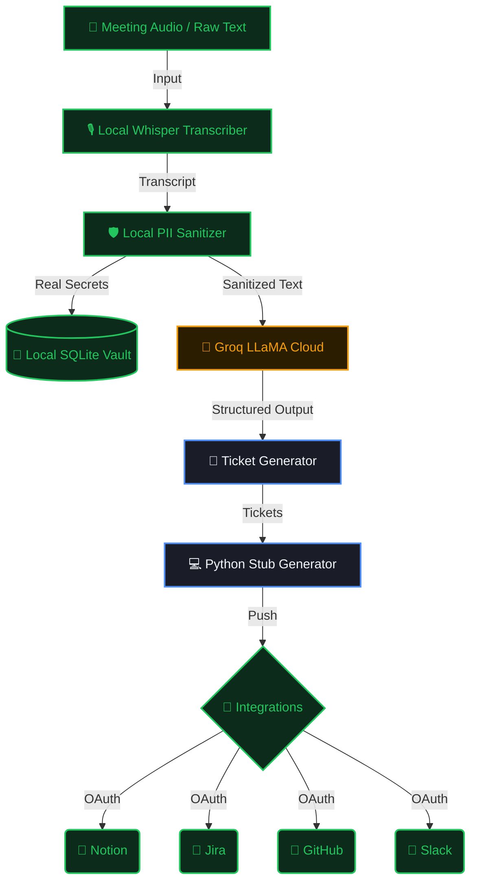

<div align="center">
  
  <h3>Privacy-first developer meeting automation. Secrets never leave your machine.</h3>

  <p align="center">
    
    
    
    
  </p>
</div>

---

OmniScribe Gatekeeper is an end-to-end local privacy-first meeting automation tool designed specifically for developers. It transcribes audio, securely detects and redacts sensitive information (like API keys, IPs, and passwords) into a local vault, uses Groq LLaMA to generate structured tickets and code stubs, and seamlessly synchronizes them to your favorite project management tools via zero-leak OAuth connections.

## 🚀 Features

- 🎙️ **Local Audio Transcription**: Uses OpenAI's Whisper (local execution) to transcribe meeting audio.
- 🛡️ **Zero-Leak Privacy Sanitizer**: Replaces API keys, Passwords, DB Strings, and PII with tokens (e.g. `[API_KEY_1]`) using `spaCy` before sending data to the cloud.
- 🔐 **SQLite Vault**: Real values are stored encrypted in a local database (`database/vault.db`) and are *never* transmitted.
- 🎫 **Automated Ticket Generation**: Leverages high-speed Groq LLaMA inference to extract action items into structured sprint tickets.
- 💻 **Python Stub Generator**: Automatically writes boilerplate Python code stubs based on the generated tickets.
- 🔌 **One-Click Integrations**: Pushes briefs and tickets to Jira, GitHub, Notion, and Slack using locally-managed OAuth tokens.

## 🧰 Tools & Technologies Used

- **Language**: Python 3.10+
- **Frontend/UI**: Gradio
- **Backend**: FastAPI, Starlette, Flask (OAuth handling)
- **AI & NLP**: 
  - **Transcription**: OpenAI Whisper (local execution)
  - **LLM/Inference**: Groq LLaMA 
  - **PII Sanitization**: spaCy
- **Database/Storage**: SQLite (Local Vault)
- **Integrations**: PyGithub, Notion Client, OAuth integrations (Jira, Slack)

## 🔄 OmniScribe Workflow



## 🛠️ Installation & Setup

> [!IMPORTANT]
> You must have Python 3.10+ installed to run OmniScribe.

1. **Clone the repository:**
   ```bash
   git clone <repository_url>
   cd omniscribe
   ```

2. **Create and activate a virtual environment (Recommended):**
   ```bash
   python -m venv .venv
   # Windows
   .venv\Scripts\activate
   # macOS/Linux
   source .venv/bin/activate
   ```

3. **Install dependencies:**
   ```bash
   pip install -r requirements.txt
   ```

4. **Download the required NLP model:**
   ```bash
   python -m spacy download en_core_web_sm
   ```

5. **Configure Environment Variables:**
   Copy the example environment file and add your API keys:
   ```bash
   cp .env.example .env
   ```
   > You will need to add your `GROQ_API_KEY` to run the LLaMA ticket extraction. 

## 🎮 Getting Started

1. **Start the application:**
   You can start the server via the provided script or directly using python:
   ```bash
   # Windows
   .\run_app.bat
   # OR
   python app.py
   ```

2. **Open the Web UI:**
   Navigate to [http://127.0.0.1:7860](http://127.0.0.1:7860) in your browser.

3. **Process a Meeting:**
   - Upload an audio file or paste raw meeting notes into the input section.
   - Click **Process -> Sanitize -> Generate Tickets -> Python Stubs**.
   - Review the privacy proofs, view your local vault, and examine the generated tickets/stubs.

### Test Input Example
If you don't have a meeting audio file handy, you can paste the following text into the UI to test the sanitizer:

```text
Meeting notes from today's sync:
We need to fix the payment retry logic. The API key is sk-abc123xyz789def456 and the server is at 192.168.1.45.
Contact John at john@company.com or +91 9845012345 for access.
Password for staging is P@ssw0rd123!

Action items:
- Implement exponential backoff for payment gateway (Assigned: Ruthvik, Priority: P1)
- Add rate limiting to the auth service (Priority: P2)
- Refactor the database connection pool (Priority: P3)
```

## 🔌 Setting up Integrations

OmniScribe uses a local OAuth server (running on port `7861`) to securely manage authentication with 3rd-party platforms. OAuth tokens are stored inside your local SQLite vault and are never transmitted to OmniScribe servers.

To enable an integration, add its client credentials to your `.env` file, restart the app, and navigate to the **Connections** tab in the UI to authenticate.

> [!TIP]
> Once connected, you can enable **Auto-Sync** in the UI to have OmniScribe automatically push meeting briefs and tickets to your connected platforms the moment the pipeline completes.

- **Notion**: Creates structured meeting briefs.
- **Jira**: Auto-creates sprint tickets inside your Jira board.
- **GitHub**: Opens issues with generated Python code stubs attached as comments.
- **Slack**: Sends meeting summaries and ticket overviews directly to your team channel.

## 📁 Data Storage
* **`database/vault.db`**: Your local SQLite vault containing securely stored secrets, session logs, and OAuth tokens.
* **`outputs/`**: Contains generated outputs (`tickets_SESSIONID.json`, `stubs_SESSIONID.py`) saved automatically during processing.
* **`patterns/`**: Contains RegEx patterns used by the sanitizer to identify sensitive information.

---
*Built with ❤️ for privacy-conscious developer teams.*
